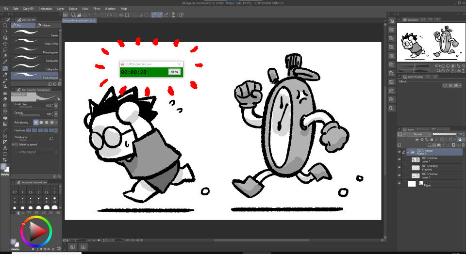
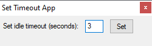

# Time tracker

A simple AutoHotKey timer for you to keep track of multiple app usages.

## History

This app is based on another similar [app created by Neil Cicierega](https://neilblr.com/post/58757345346) (Note: As of writing, he did a cheeky thing by turning the page black. Click the "Lights" text to show the contents of the page). His app was great but I wanted a different version that suited my use case better. Neil's version allows to track up to 3 different apps, but they all share the same timer. My version allows to track any number of apps, and each app has their own timer.

The script is for AutoHotKey (AHK) version 1.1. The code was created with [Claude 3.7 Sonnet](https://claude.ai) (free). I manually tweaked some logic after the initial code was generated. I am not familiar with AHK but there is [documentation (v1.1)](https://www.autohotkey.com/docs/v1/) available, so it's not difficult to figure things out if AI is unable to generate the necessary code.

Accompanying blog post here: https://laksapedia.com/blog/2025-05-03-time-tracker

## Download

Go to the [releases page](https://github.com/laxa88/time-tracker/releases) and download the `time-tracker.exe` file. Note: It's only for Windows.

## Features

- When a tracked app is active, a timer will start counting.
- If you switch between different tracked apps, the timer will resume for the corresponding app.

- If the user switches focus to an untracked app, the timer will turn grey and pause counting.
- If there is no use activity (mouse movement or clicks or keyboard presses) while the app is active, the timer will also pause after a timeout.

- Timer is saved automatically when you close.

## Usage

### Reset app timer

You can go to `Menu > Reset current timer` to reset the time for the current app being tracked. Note: You cannot undo this action.

You can go to `Menu > Reset ALL timers` to reset the time for all apps being tracked. Note: You cannot undo this action.

### Track a new app

To add an application you want the timer to track, go to `Menu > Track New App`.

When the `Click on any window or taskbar button to select the app to track` message appears, click the app you want to track.

If it tracks correctly, you will see the name appear in the input window. You can change the name if you want. Click `OK` to add the app to your tracker.

### Remove a tracked app

To remove an application from your tracked list, go to `Menu > Remove App`. Click the app name you want to remove, then click `Remove`.

### Set timeout

To change the idle timeout, go to `Menu > Set timeout`. Input the value in seconds, then click `Set`.

## Development

You'll need [AutoHotKey (AHK) v1.1](https://www.autohotkey.com/) to run or compile the script.
