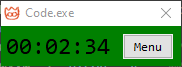

# Time tracker

A simple AutoHotKey timer for you to keep track of multiple app usages.

## Features

When a tracked app is active, a timer will start counting. If you switch between different apps, the timer will resume for the corresponding app.

If the user moves to a different app, the timer will turn grey and pause counting.

## History

This app is based on another similar [app created by Neil Cicierga](https://neilblr.com/post/58757345346) (Note: As of writing, he did a cheeky thing by turning the page black. Click the "Lights" text to show the contents of the page). His app was great but I wanted a different version that suited my use case better.

The script is for AutoHotKey (AHK) version 1.1. The script was created with [Claude 3.7 Sonnet](https://claude.ai) (free). I manually tweaked some logic after the initial code was generated. I am not familiar with AHK but there is [documentation (v1.1)](https://www.autohotkey.com/docs/v1/) available, so it's not difficult to figure things out if AI is unable to generate the necessary code.

## Usage

### Track a new app

To add an application you want the timer to track, go to `Menu > Track New App`.

When the `Click on any window or taskbar button to select the app to track` message appears, click the app you want to track.

If it tracks correctly, you will see the name appear in the input window. You can change the name if you want. Click `OK` to add the app to your tracker.

### Remove a tracked app

To remove an application from your tracked list, go to `Menu > Remove App`. Click the app name you want to remove, then click `Remove`.

### Reset current tracked app's timer

You can go to `Menu > Reset current timer` to reset the time for the current app being tracked. Note: You cannot undo this action.

## Development

You'll need [AutoHotKey (AHK) v1.1](https://www.autohotkey.com/) to run or compile the script.
